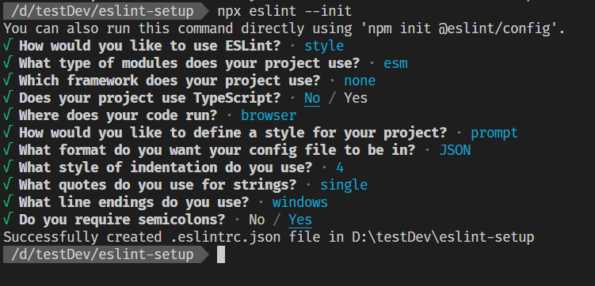

# eslint setup

## javascript



### .eslintrc.json

```diff
{
    "env": {
        "browser": true,
        "es2021": true
    },
    "extends": "eslint:recommended",
    "overrides": [
    ],
    "parserOptions": {
        "ecmaVersion": "latest",
        "sourceType": "module"
    },
    "rules": {
        "indent": [
            "error",
-           4            
+           2
        ],
        "linebreak-style": [
            "error",
            "windows"
        ],
        "quotes": [
            "error",
            "single"
        ],
        "semi": [
            "error",
            "always"
        ],
+       "no-unused-vars": 1        
    }
}

```

### .prettierrc

```diff
{
  "arrowParens": "always",
  "bracketSameLine": false,
  "bracketSpacing": true,
  "cursorOffset": -1,
  "editorconfig": false,
  "endOfLine": "auto",
  "embeddedLanguageFormatting": "auto",
  "htmlWhitespaceSensitivity": "css",
  "insertPragma": false,
  "jsxSingleQuote": true,
  "parser":"babel",
  "printWidth": 80,
  "proseWrap": "preserve",
  "quoteProps": "as-needed",
  "singleQuote": true,
  "tabWidth": 2,
  
  "rangeStart": 0,
  "requirePragma": false,
  "semi": true,
  "singleAttributePerLine": false,
  "trailingComma": "es5",
  "useTabs": false,  
  
  "filepath": "",
  "overrides": [],
  "plugins": []
}

```